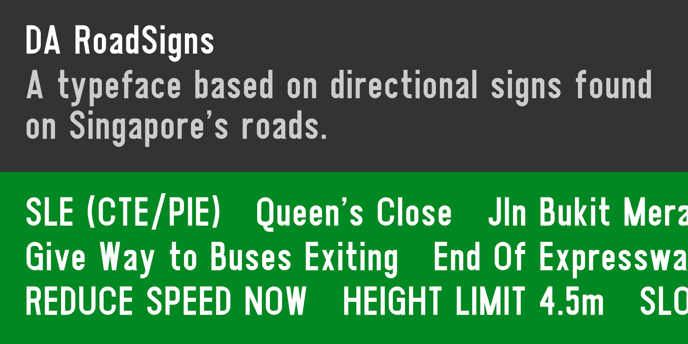
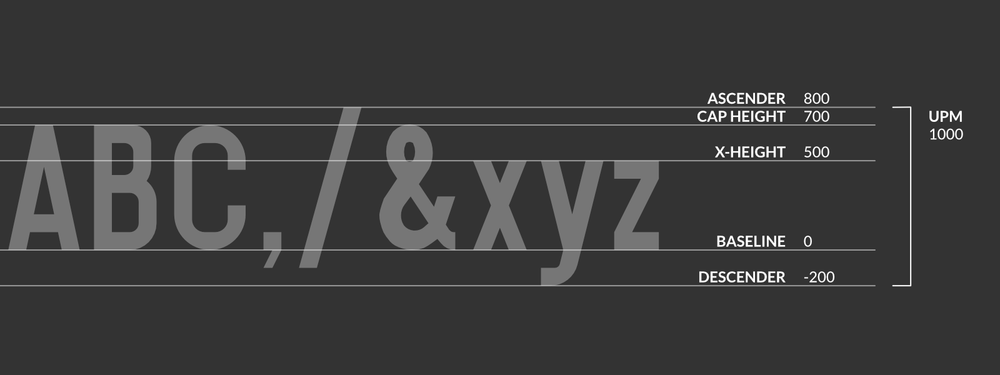

# DA RoadSigns

-----

## [⬇ Downloads and changelog](https://github.com/joeyfoo/da-roadsigns-font/releases)

The font is available in OpenType (CFF) and WOFF formats.

A [preview of the font](https://roadsigns.dangeraspect.xyz/) used as a webfont is also available. 

-----

## Overview

**DA RoadSigns** is a font based on the typeface used on the directional signs found on Singapore's roads. 

## Usage notes

This typeface is not recommended for use at smaller font sizes - it has not been optimised for clarity or readability. It appears best when used at larger sizes, usually as white text on a dark-coloured background. 

**⚠️ Please note:** The typeface is based on **but not exactly the same** as the Land Transport Authority's road element standards - some elements may be different.

### Glyphs

The following glyphs are currently included:
* Alpha-numeric characters (A-Z, a-z, 0-9)
* Several common symbols
  * Ampersand `&`
  * Apostrophe `'`
  * Parenthesis, left and right `()`
  * Comma `,`
  * Dash `-`
  * Dot `.`
  * Forward slash `/`
  * Colon `:`
* Several arrows (see note below)
  * Reduced-sized arrows
  * To-scale right arrow
  * To-scale downward-pointing lane arrow

Arrows are available for input using the usual emoji-input methods: [a preview is available here](https://roadsigns.dangeraspect.xyz/#arrows).

| Arrow type | Emoji | Unicode code point
|--|--|--
| Reduced-sized up arrow | ⬆ | `U+2B06`
| Reduced-sized up-right arrow | ↗ | `U+2197`
| Reduced-sized right arrow | ➡ | `U+27A1`
| Reduced-sized down-right arrow | ↘ | `U+2198`
| Reduced-sized down arrow | ⬇ | `U+2B07`
| Reduced-sized down-left arrow | ↙ | `U+2199`
| Reduced-sized left arrow | ⬅ | `U+2B05`
| Reduced-sized up-left arrow | ↖ | `U+2196`
| Full-size right arrow | ▶ | `U+25B6`
| Full-size downward lane arrow | 🔽 | `U+1F53D`

### Metrics and spacing

* UPM: `1000`
* Ascender: `800`
* Cap height: `700`
* x-height: `500`
* Baseline: `0`
* Descender: `-200`

In other words, to get an x-height of 25mm, use a font size of 50mm (~142 pt), which will yield a cap-height of 35mm. 

The recommended vertical spacing between text in the _Standard Details of Road Elements_ is 20mm at an x-height of 25mm, which would equate to a line spacing of 120%. 

## Development notes

### Software

This font was produced using [FontForge](https://fontforge.org/), with letterforms created in [Affinity Designer](https://affinity.serif.com/designer/) and exported as SVG. 

### References

The letterforms are based on the Land Transport Authority's standards for road signs, specifically [Standard Details of Road Elements, chapter 7 (LTA/SDRE14/7)](https://www.lta.gov.sg/content/ltagov/en/industry_innovations/industry_matters/development_construction_resources/street-work-proposals/codes_of_practice_standards_specifications_guides_and_forms.html).
